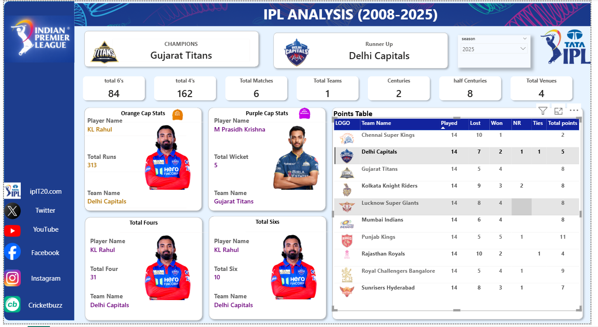
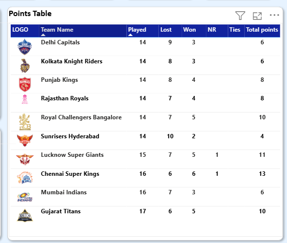
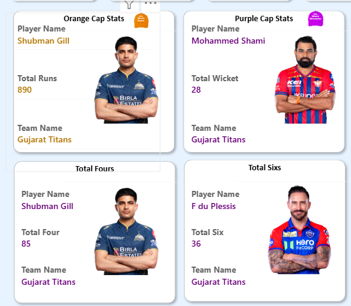

# IPL-Data-Analysis
Power BI IPL Data Analysis Project (2008–2025)

## Tools Used

* Power BI
* Excel

## Project Overview

This project analyzes IPL data from 2008 to 2025 to uncover insights about team performance, player statistics, and match trends.

## Key Insights

* Gujarat Titans emerged as champions
* KL Rahul was among top performers
* Toss impacts match outcomes
* Team performance varies across seasons

## Dashboard Features

* Champions & Runner-up
* Orange Cap & Purple Cap
* Points Table
* Player Statistics

## Dashboard Preview

## Files Included

* IPL_Analysis.pbix
